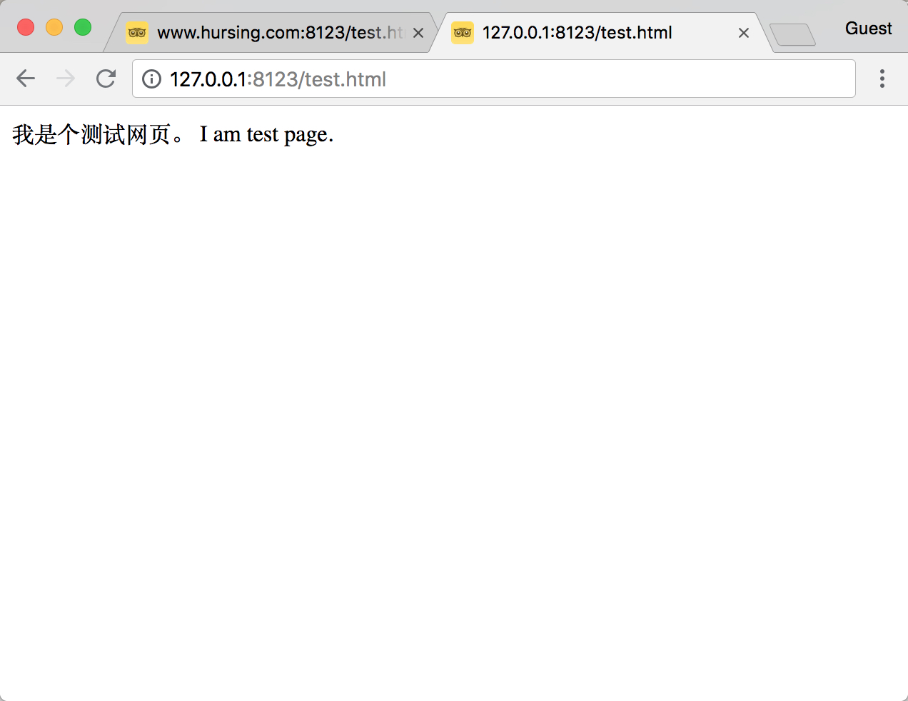
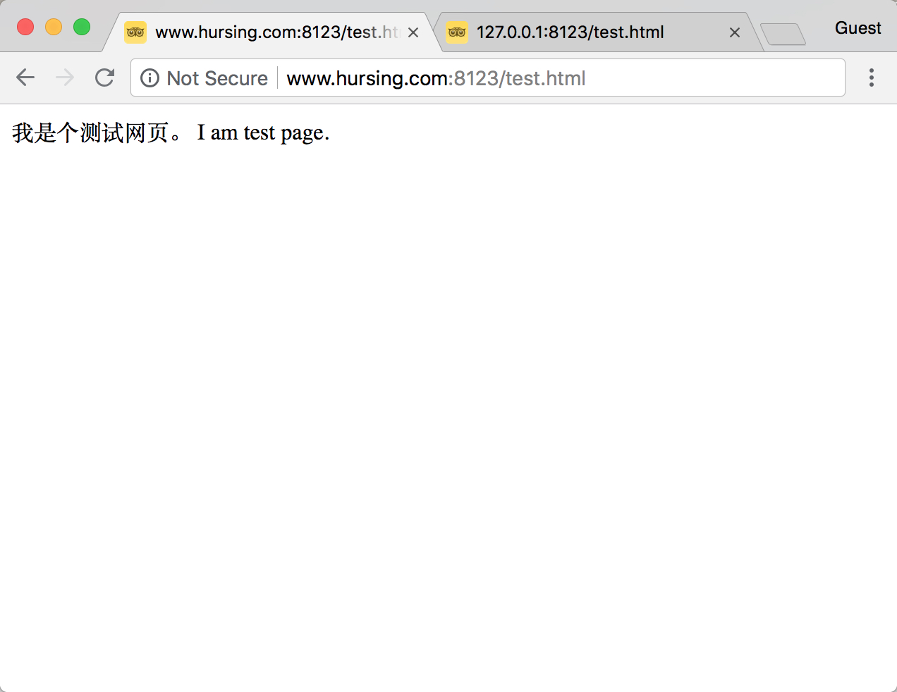
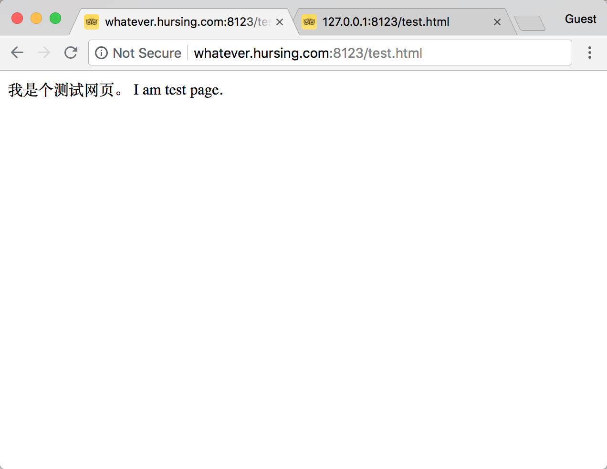
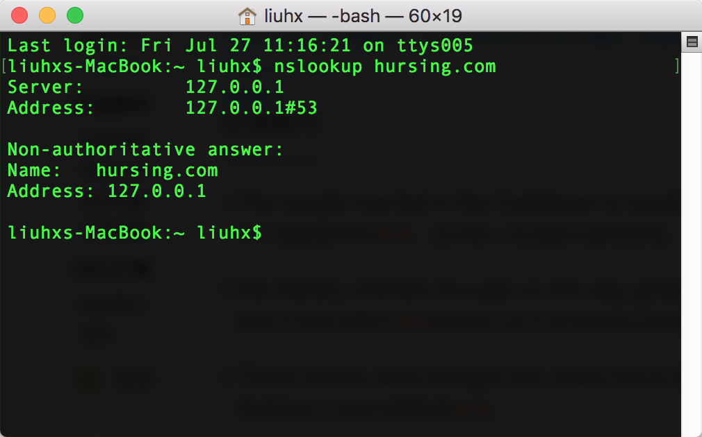
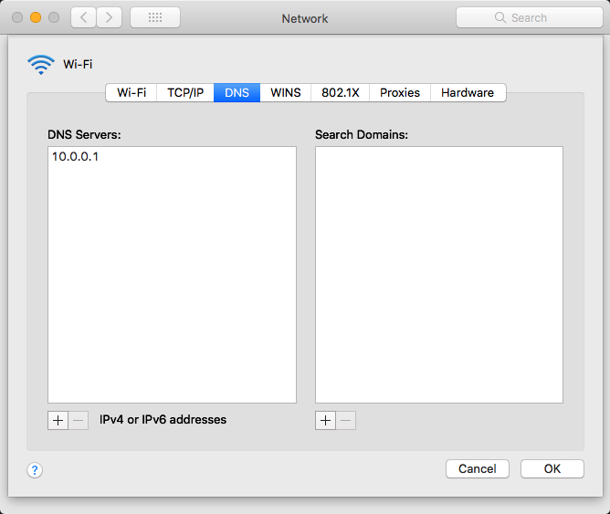
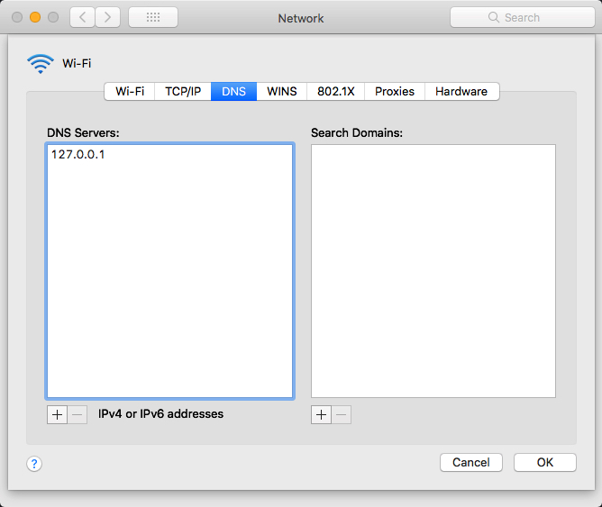
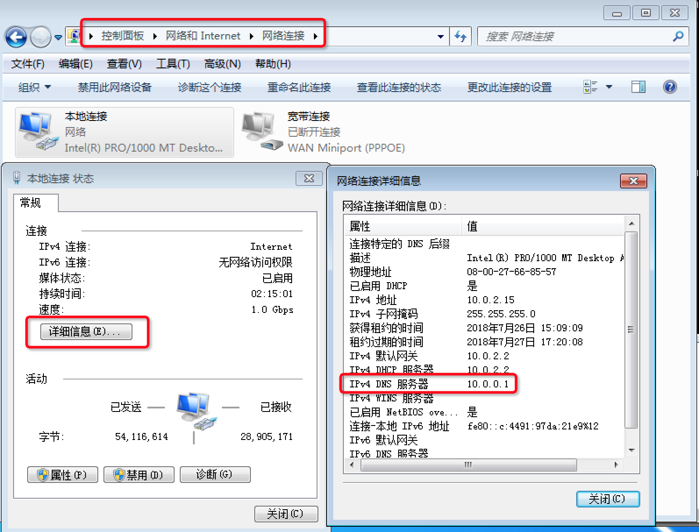
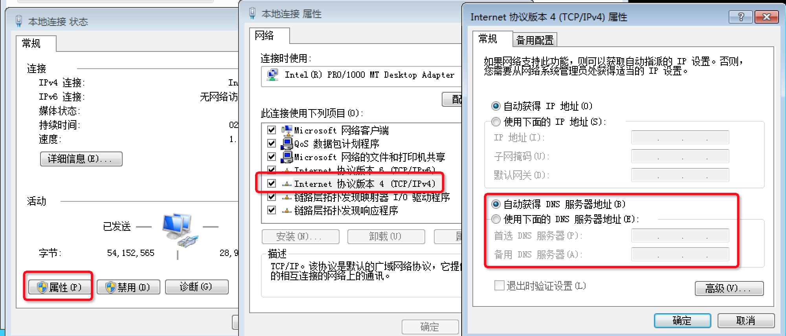
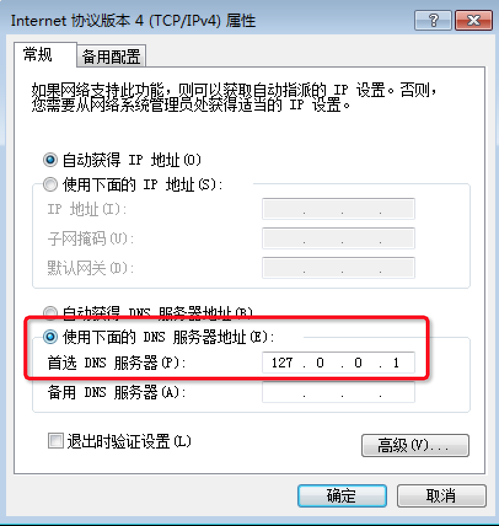
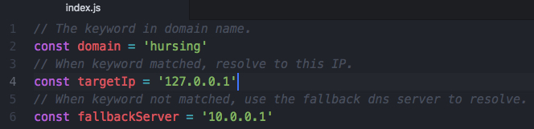

# dns-server
A DNS server app written by pure Nodejs for develop and test use. Only support IPv4 now.

To resolve specified domain name to specified IP using keyword-matching algorithm. Useful for frontend developer and tester when involved into a website project.

纯Nodejs写的本地DNS服务器，供开发测试使用。

前端做网站时，本地开发通常是用nginx或nodejs做服务器，然后在浏览器中使用IP地址（127.0.0.1或localhost）来打开网站。但有些功能需要有域名（或二级域名）才能工作，那么就可以用这个工具来做本地解析，对符合关键字的域名查询指向指定的IP。

## 效果图 effect

请留意各图中的url地址，实际上`hursing.com`不存在的。Please look at the url and know that the `hursing.com` does not exist actually.

## 使用方法 How to use

按照图示，找到原来的DNS服务器地址，并改成`127.0.0.1`。Follow the steps, find the original dns server and change it to `127.0.0.1`.

### Mac

修改前 before change:

修改后 after change:

### Windows

查看原来的dns服务器地址 view the original dns server:

修改前 before change:

修改后 after change:

### 启动dns服务 launch dns server

打开 open`index.js`:

对上面的代码做修改 modify the code

- 把`fallbackServer`改成原来的DNS服务器地址 change `fallbackServer` to your original dns server address
- 把`domain`改成你想解析的域名关键字 change `domain` to the keyword of your expected domain name
- 把`targetIp`改成你想解析到的IP地址 change `targetIp` to the resolved IP

然后运行 then run `node index.js`。mac上需要 on mac you have to run `sudo node index.js`。

## 实现原理 implement

DNS protocol: https://tools.ietf.org/html/rfc1035

## 可以做更多 You can do more

- 加入配置文件，可匹配多个关键字 use configuration file for matching multiple keywords
- 增加命令行参数，不用在源码修改关键字 add command line args support to avoid modifying keyword in source code
